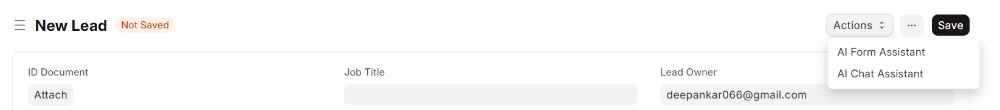
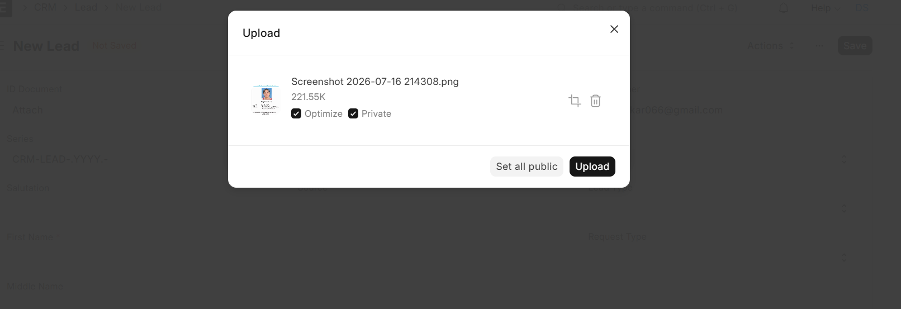
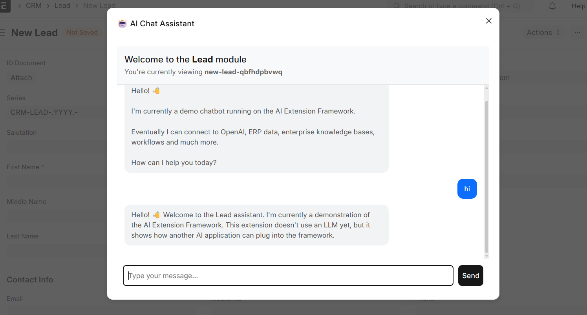
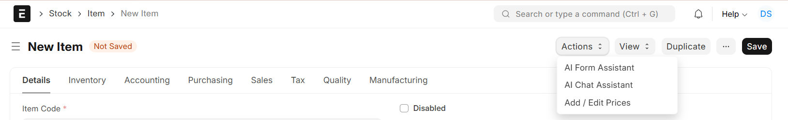
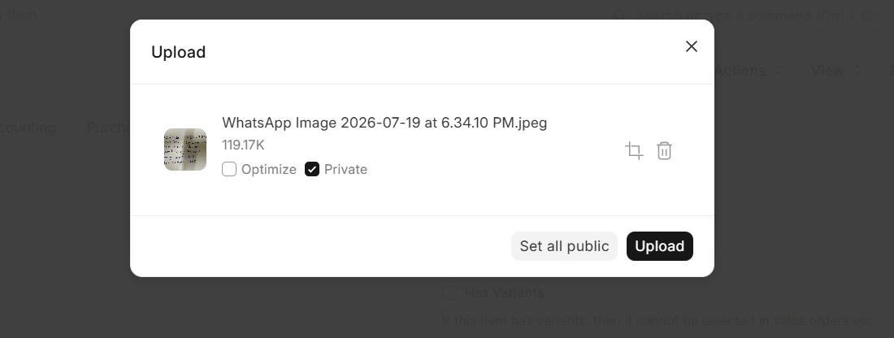
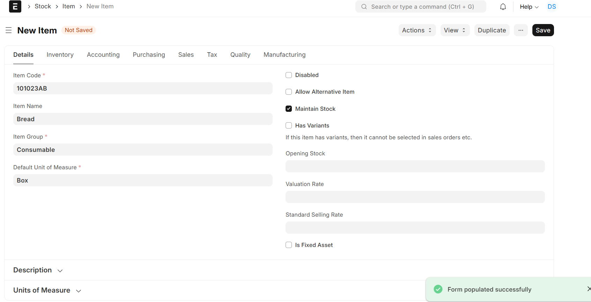
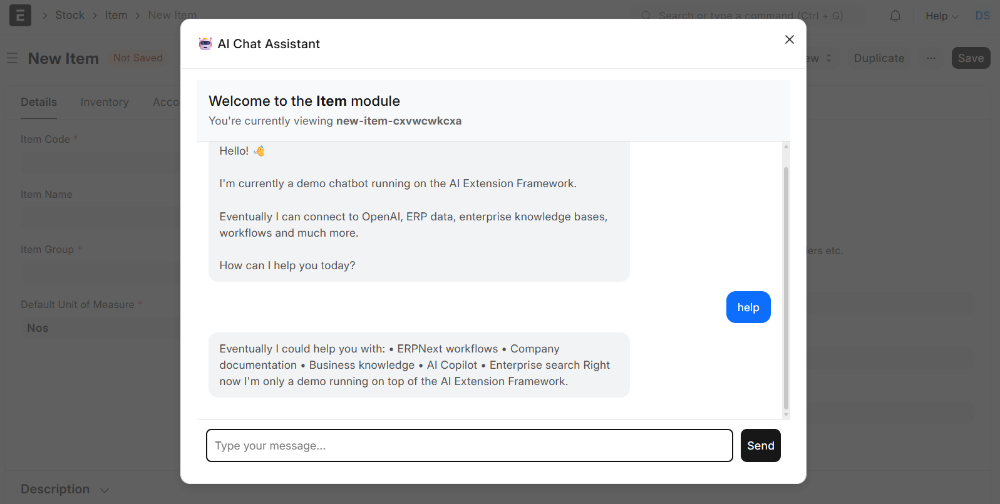
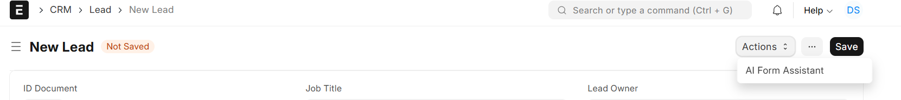
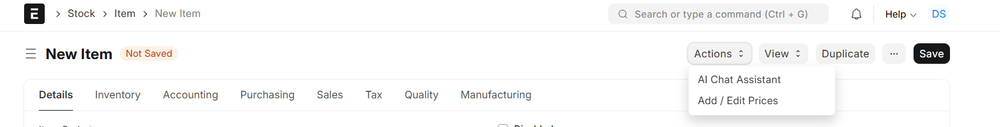

# AI Extension Framework for ERPNext

A modular AI Extension Framework built on top of ERPNext that enables multiple AI-powered applications to be seamlessly integrated into ERPNext.

---

# Overview

The project initially started with implementing a heuristic-based AI Form Assistant for automatically extracting information from uploaded documents.

During development, it became evident that building individual AI features independently would not scale well. The focus was therefore shifted towards building a reusable AI Extension Framework capable of hosting multiple AI applications inside ERPNext.

The framework currently includes:

- AI Form Assistant
- AI Chat Assistant

while allowing future AI applications to be added with minimal effort.

---

# Features

- Modular AI Extension Framework
- Plugin-based architecture
- Generic frontend extension loader
- Modular backend application structure
- Dynamic DocType support
- Context-aware extension loading
- AI Form Assistant
- AI Chat Assistant

---

# Demo Video

A complete walkthrough of the framework, architecture, and validation tests can be found here:

**Google Drive Link**

> https://drive.google.com/file/d/11gpGEj8LTWxUJyopDRgycckz2uxB6Rhy/view?usp=sharing

---

# Project Architecture

```
Frontend

framework/
extensions/
    form_assistant/
    chat_assistant/

↓

Backend

applications/
    form_assistant/
    chat_assistant/

↓

Shared Components

common/
```

---

# Test 1 – Multiple AI Applications

The framework supports multiple AI applications running simultaneously on the same ERPNext form.

## Lead Form

Both AI applications loaded.



### AI Form Assistant

Upload a business card or document for automatic extraction.



### Auto-filled Lead

Lead fields populated automatically using OCR + LLM.


### AI Chat Assistant

Context-aware AI Chat Assistant.



---

## Item Form

Both AI applications loaded successfully inside another ERPNext module.



### AI Form Assistant



### Auto-filled Item



### AI Chat Assistant



---

# Test 2 – Extension Isolation

The framework supports independent loading of AI applications based on the current ERPNext context.

Example configuration:

- AI Form Assistant → Lead
- AI Chat Assistant → Item

## Lead Form

Only AI Form Assistant is loaded.



## Item Form

Only AI Chat Assistant is loaded.



---

# Current AI Applications

## AI Form Assistant

- OCR-based document extraction
- LLM-powered field mapping
- Dynamic DocType support
- Automatic ERPNext form population

---

## AI Chat Assistant

- Context-aware chatbot
- Extension framework integration
- Modular architecture
- Ready for future RAG integration

---

# Future Roadmap

- Context-aware AI Chat Assistant
- Admin configuration for AI applications
- AI Report Assistant
- AI Email Assistant
- AI Workflow Assistant
- AI Insights Dashboard
- Additional ERPNext AI Extensions

---

# Author

**Deepankar Senapati**