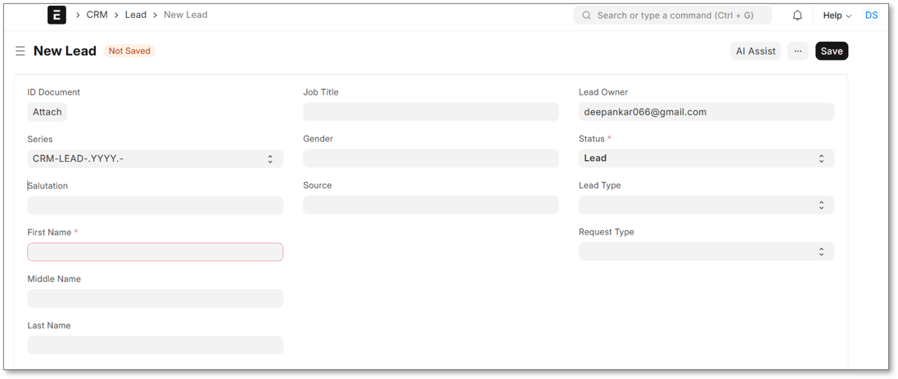
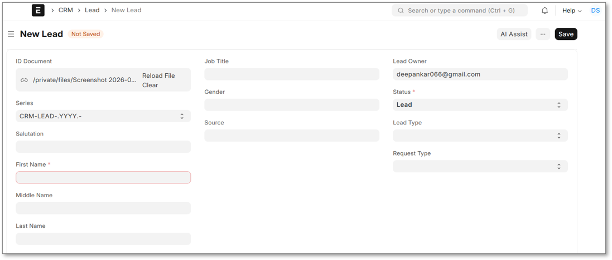
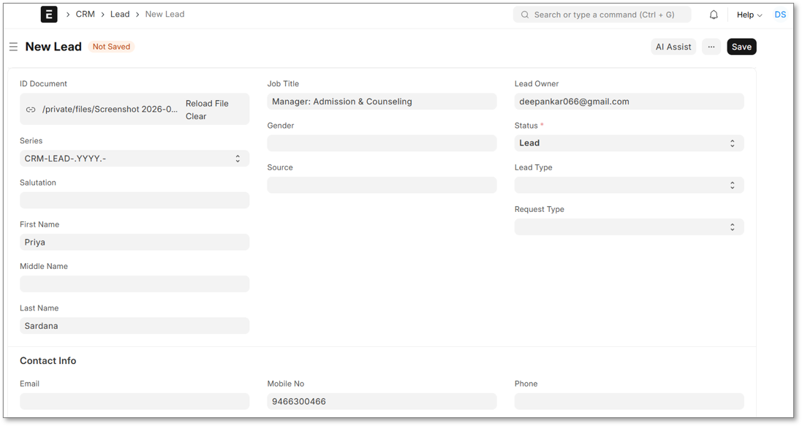

# AI Lead Assistant

An AI-powered ERPNext extension that automates Lead creation from uploaded documents using the Frappe Framework.

---

## Overview

AI Lead Assistant is a custom Frappe application developed for ERPNext CRM.

The extension allows users to upload a document (such as an ID card, business card, or image), extract relevant information using OCR, and automatically populate Lead fields. This reduces manual data entry while improving efficiency and accuracy.

The project demonstrates how AI can be integrated into ERPNext through a modular, upgrade-safe custom application without modifying the ERPNext core.

---

## Demo Video

🎥 Watch the project demonstration here:

**Google Drive:**  
https://drive.google.com/file/d/1Xu3gFgqrpi4maC38-51Wscgai0J9Vk9-/view?usp=sharing

## Features

- AI Assist button integrated into the Lead form
- OCR-based information extraction
- Automatic Lead field population
- Modular service-oriented architecture
- Built as a custom Frappe application
- Upgrade-safe (no ERPNext core modifications)

---

# How it Works

### Step 1 - Attach the ID Document

Upload an ID document (business card, ID card, or similar document) to the **ID Document** field on the Lead form.

<p align="center">
  
</p>

---

### Step 2 - Click **AI Assist**

Click the **AI Assist** button to extract information from the uploaded document.

<p align="center">
  
</p>

---

### Step 3 - Review & Save

The extracted information is automatically populated into the Lead fields. Review the generated values and save the Lead.

<p align="center">
  
</p>
## Technology Stack

- ERPNext v15
- Frappe Framework v15
- Python
- JavaScript (Client Scripts)
- OCR

---

## Architecture

```
Lead Form
     │
     ▼
AI Assist Button
     │
     ▼
Client Script
     │
     ▼
Whitelisted API
     │
     ▼
Lead Service
     │
     ▼
File Service
     │
     ▼
OCR Service
     │
     ▼
Populate Lead Fields
```

---

## Project Structure

```
ai_lead_assistant/
├── api.py
├── hooks.py
├── public/
│   └── js/
├── services/
│   ├── lead_service.py
│   ├── file_service.py
│   └── ocr_service.py
```

---

## Future Improvements

- Duplicate Lead Detection
- AI-based Lead Scoring
- Suggested Sales Representative
- Suggested Industry & Territory
- Confidence Score for AI Predictions
- Batch Lead Creation from Multiple Documents

---

## Installation

Clone the repository into your Frappe Bench.

```bash
cd frappe-bench

bench get-app https://github.com/<your-github-username>/AI-Lead-Assistant.git

bench --site <site-name> install-app ai_lead_assistant

bench migrate
```

---

## License

This project is licensed under the MIT License.